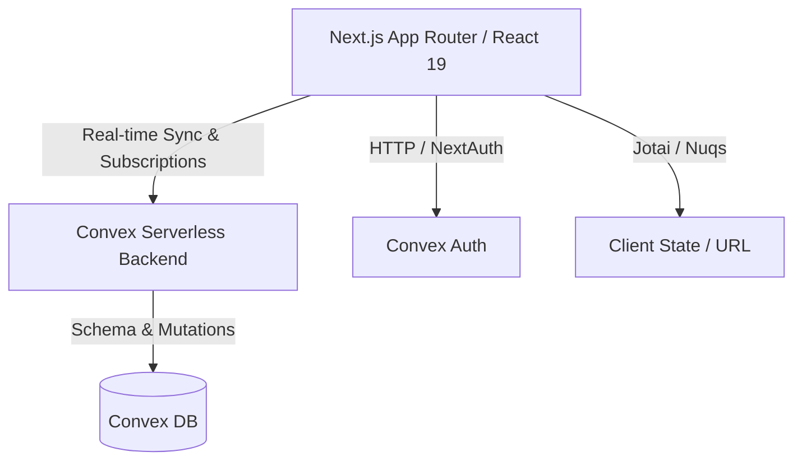

<!-- BEGIN:nextjs-agent-rules -->
# This is NOT the Next.js you know

This version has breaking changes — APIs, conventions, and file structure may all differ from your training data. Read the relevant guide in `node_modules/next/dist/docs/` before writing any code. Heed deprecation notices.
<!-- END:nextjs-agent-rules -->

# Project Overview

A robust, real-time Slack clone serving as a highly interactive communication platform. Built with Next.js 16+, Convex for real-time data sync and serverless backend, and Tailwind CSS for styling, it supports secure workspaces, direct messaging, rich-text formatting, and role-based access.

## Repository Structure

* `src/app/` – Next.js App Router containing all pages, layouts, and route definitions.
* `src/components/` – Reusable UI components, largely built with Radix UI and Tailwind.
* `src/features/` – Domain-specific logic grouping hooks, components, and interactions (e.g., auth, messages).
* `src/hooks/` – Shared global React hooks for cross-cutting utility behaviors.
* `src/lib/` – Helper utilities, system configurations, and shared constant values.
* `convex/` – Backend database schema, real-time queries, mutations, and authentication handlers.
* `public/` – Static assets including logos, favicons, and other non-compiled media.

## Build & Development Commands

```bash
# Install dependencies
npm install

# Start Next.js development server
npm run dev

# Start Convex development server (run in parallel with Next.js)
npx convex dev

# Type-check the project
npx tsc --noEmit

# Run ESLint to analyze code
npm run lint

# Automatically fix linting issues
npm run lint:fix

# Build for production
npm run build

# Start production server
npm run start
```

## Code Style & Conventions

* **Formatting & Linting**: Strictly enforced via ESLint. `simple-import-sort` requires grouped and sorted imports; `react/jsx-sort-props` mandates sorting React props.
* **Component Naming**: PascalCase for files and exports representing React components.
* **State Management**: `jotai` for client-side atom-based state, and `nuqs` for URL search parameter state.
* **Commit Messages**: Enforced Conventional Commits format (e.g., `feat: add chat`, `fix: header layout`).

## Architecture Notes



The application relies on the Next.js App Router for frontend routing and SSR, while core domain state is synchronized in real-time through Convex WebSockets. Authentication leverages `@convex-dev/auth`, and rich-text editing is handled entirely client-side using Quill.js.

## Testing Strategy

To ensure code stability, run both our unit and End-to-End (E2E) suites locally before pushing. (Note: Originally marked as "TODO: Configure and document testing frameworks (e.g., Playwright for E2E, Vitest/Jest for unit tests)", these are the current runnable steps to follow once tools are set up.)

### Running Tests Locally

1. **Unit Tests (Vitest)**
   Ensure `vitest.config.ts` is configured. Run unit tests to verify components and isolated logic natively:
   ```bash
   npm run test:unit
   ```
   *Target: `src/**/*.test.ts` and `src/**/*.test.tsx`*

2. **E2E Tests (Playwright)**
   Ensure `playwright.config.ts` incorporates local development URLs. Spin up both Next.js and Convex servers locally, then run Playwright:
   ```bash
   # Terminal 1 - start Next app
   npm run dev

   # Terminal 2 - start Convex
   npx convex dev

   # Terminal 3 - run tests
   npm run test:e2e
   ```
   *Target: tests in `tests/` or `e2e/` folder*

## Security & Compliance

* **Secrets Handling**: Environment variables are protected in `.env.local` and must never be committed; Convex deployment keys require absolute confidentiality.
* **Access Control**: Handled systematically via Convex mutations validating session tokens and user roles before continuing database interaction.
* **License**: Released and maintained under the MIT License.

## Agent Responsibilities

* Never alter the core `convex/schema.ts` without explicit user review and approval.
* Do not commit secrets, environment variables, or generated credential sets.
* Keep architecture scope strictly mapped to specific directories (`src/features/` or `src/components/`) to maintain feature-sliced boundaries.
* Ensure `npx tsc --noEmit` and `npm run lint` both pass cleanly before suggesting a feature is complete.

## Agent Capabilities

* **Allowed Actions**: Can suggest code changes, create pull requests, run tests locally or via CI, and read all repository files.
* **Prohibited Actions**: Cannot merge pull requests, cannot exfiltrate secrets, and cannot change the core schema without explicit user approval.

## Extensibility Hooks

> TODO: Define structured plugin points. Current extensibility relies on standard React component composition and extending the `src/features/` footprint with isolated domain silos.

## Further Reading

* [README.md](./README.md) – General instructions and setup methodology.
* [Convex Documentation](https://docs.convex.dev/home) – For backend schema and query reference.
* [Next.js Documentation](https://nextjs.org/docs) – Up-to-date App Router guidelines.
